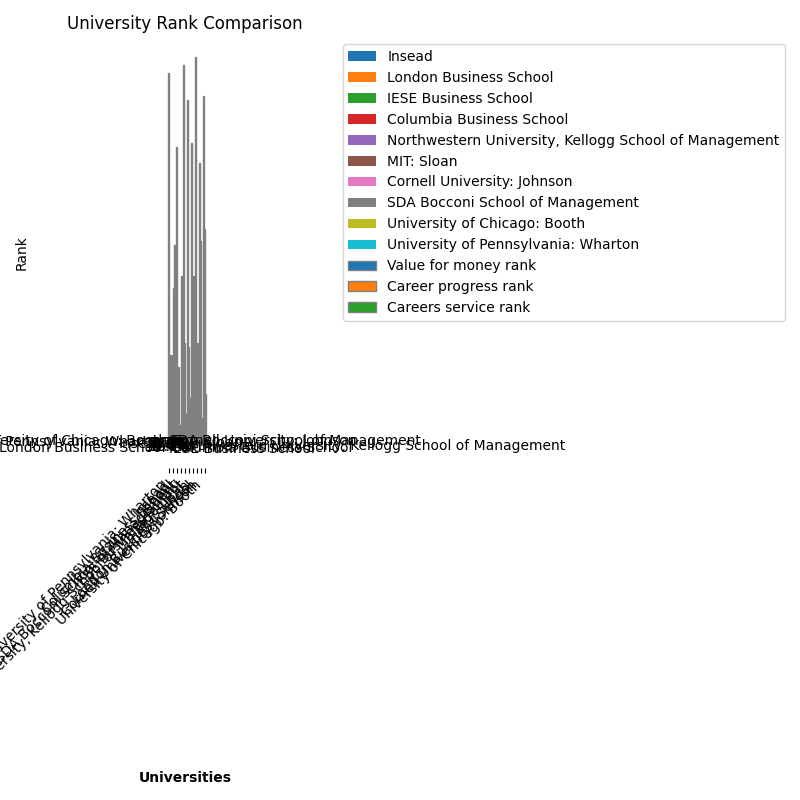

# Nakiyah_Assignment3

This repository contains my work for **Week 3** of the IDS706 course, where the purpose of this project is to transform the previous project (Pandas descriptive statistics) into generating descriptive statistics on datasets using Polars.

## File Structure 
```
Vishesh_Gupta_Individual_Project_1/
├── .devcontainer/
│   ├── devcontainer.json
│   └── Dockerfile
├── .github/
│   ├── workflows/CI.yml
├── .gitignore
├── Makefile
├── main_python.py             # Main Python script for data analysis
├── main_python_jp.ipynb        # Jupyter Notebook version of the analysis
├── pandas_main_python.py       # Alternative analysis using Pandas
├── test_main.py                # Test cases for validating the code
├── requirements.txt            # List of required packages for the project
├── 2023-2024 NBA Player Stats - Regular.csv  # Dataset used for analysis
├── bar_graph.png               # Bar graph visualization of NBA player stats
├── line_graph.png              # Line graph of trends in NBA player stats
```

NEED TO UPDATE THIS ABOVE

## Project Overview

The module performs the following key tasks:

1. **Loading and Cleaning NBA Data:** The CSV file containing player stats is loaded using Polars, and basic cleaning and formatting are applied.
2. **Data Aggregation:** Player statistics are grouped by position and team, with the total points and average points per player calculated.
3. **Visualization:** The aggregated data is visualized using line and bar graphs to show the distribution of points per position and team.


## Functions Overview
- **`readData(df)`**: Reads a CSV file into a Polars DataFrame with specified encoding.
- **`summaryStatistics(df, Col)`**: Generates summary statistics, median, and mean for a specified column.
- **`cleanData(df, ColToSort, Columns, RanksRequired)`**: Sorts a DataFrame by a column and selects the top N rows for specified columns.
- **`PiePlot(df, col, labels_col)`**: Creates a pie chart showing the breakdown of a specified column by labels.
- **`tripleBarPlot(df, Col, RankCols)`**: Plots a comparative bar chart for rankings of universities across multiple columns.

## Summary stats showing the results for inputed dataset:

NEED TO PUT IN

## Data Visualisation 





