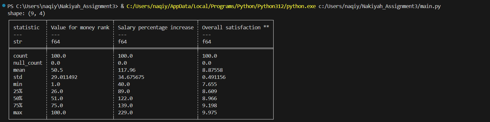
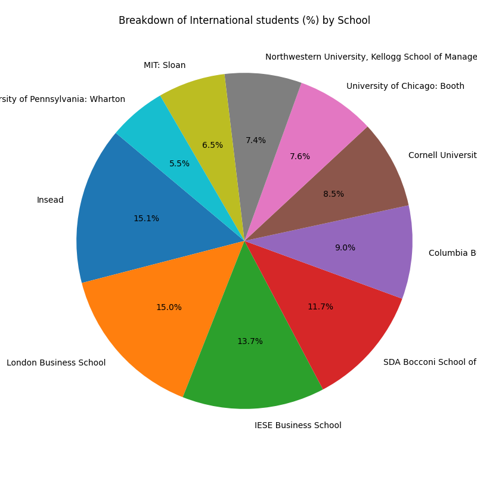

# Nakiyah_Assignment3

[](https://github.com/nogibjj/Nakiyah_Assignment3/actions/workflows/install.yml) [](https://github.com/nogibjj/Nakiyah_Assignment3/actions/workflows/format.yml) [](https://github.com/nogibjj/Nakiyah_Assignment3/actions/workflows/lint.yml) [](https://github.com/nogibjj/Nakiyah_Assignment3/actions/workflows/test.yml)

This repository contains my work for **Week 3** of the IDS706 course, where the purpose of this project is to transform the previous project (Pandas descriptive statistics) into generating descriptive statistics on datasets using Polars.

## File Structure 
```
Nakiyah_Assignment3/
├── .devcontainer/
│   ├── devcontainer.json
│   └── Dockerfile
├── .github/
│   ├── workflows/format.yml
│   ├── workflows/install.yml
│   ├── workflows/lint.yml
│   ├── workflows/test.yml
├── mylib/
│   ├── lib.py
├── .gitignore
├── Makefile
├── main.py                                         
├── main.ipynb                                      
├── test_file.py                                    
├── test_lib.py                                     
├── requirements.txt                                
├── FT Global Business School MBA Ranking 2024.csv                  
├── piePlotFaculty.png                              
├── piePlotStudents.png
├── SummaryStats.png                             
```

## Project Overview

The module performs the following key tasks:

Key Tasks
**Loading Data:**
The code reads and loads a CSV file containing MBA school data using the Polars library, ensuring fast and efficient data processing.

**Data Cleaning:**
Basic data cleaning operations are performed, including sorting the data by specified columns and selecting the top N rows based on defined criteria.

**Generating Summary Statistics:**
The module computes essential summary statistics, such as the sum, mean, and median for specified columns in the dataset, providing insights into the distribution of key metrics.

**Data Visualization:**
The code generates multiple types of visualizations, including:
Pie Charts: Displaying the breakdown of International Students/Faculty acros universities..


## Functions Overview
- **`readData(df)`**: Reads a CSV file into a Polars DataFrame with specified encoding.

- **`summaryStatistics(df, Col)`**: Generates summary statistics, median, and mean for a specified column.

- **`cleanData(df, ColToSort, Columns, RanksRequired)`**: Sorts a DataFrame by a column and selects the top N rows for specified columns.

- **`PiePlot(df, col, labels_col)`**: Creates a pie chart showing the breakdown of a specified column by labels.


## Summary stats showing the results for inputed dataset:




## Data Visualisation 



