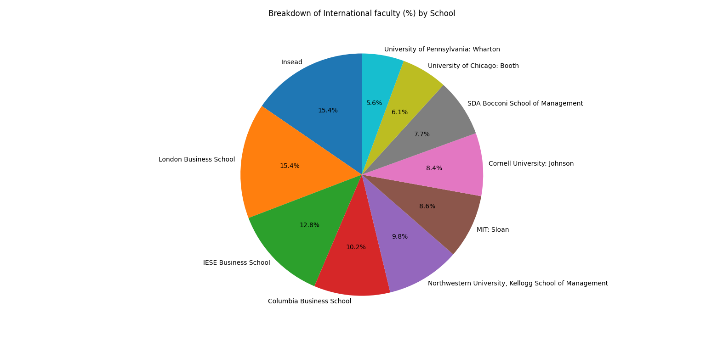
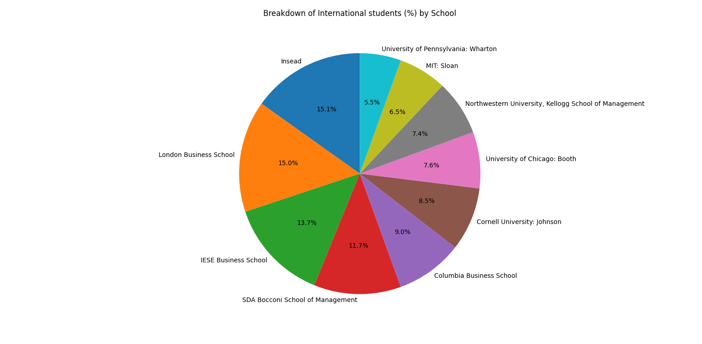

# Nakiyah_Assignment3

This repository contains my work for **Week 3** of the IDS706 course, where the purpose of this project is to transform the previous project (Pandas descriptive statistics) into generating descriptive statistics on datasets using Polars.

## File Structure 
```
Nakiyah_Assignment3/
├── .devcontainer/
│   ├── devcontainer.json
│   └── Dockerfile
├── .github/
│   ├── workflows/format.yml
│   ├── workflows/install.yml
│   ├── workflows/lint.yml
│   ├── workflows/test.yml
├── mylib/
│   ├── lib.py
├── .gitignore
├── Makefile
├── main.py                                         # Main Python script for data analysis
├── main.ipynb                                      # Jupyter Notebook version of the analysis
├── test_file.py                                    # Test cases for validating the code
├── test_lib.py                                     # Test Functions
├── requirements.txt                                # List of required packages for the project
├── FT Global Business School MBA Ranking 2024.csv  # Dataset used for analysis
├── University_Rank_Comparison.png                  # Bar Chart of University Rankings
├── piePlotFaculty.png                              # Pie Chart of Internation Faculty
├── piePlotStudents.png                             # Pie Chart of Internation Students
```

## Project Overview

The module performs the following key tasks:

1. **Loading and Cleaning MBA School Data:** The CSV file containing different MBA programs is loaded using Polars, and basic cleaning and formatting are applied.
2. **Summary Statistics:** Player statistics are grouped by position and team, with the total points and average points per player calculated.
3. **Visualization:** The aggregated data is visualized using line and bar graphs to show the distribution of points per position and team.


## Functions Overview
- **`readData(df)`**: Reads a CSV file into a Polars DataFrame with specified encoding.
- **`summaryStatistics(df, Col)`**: Generates summary statistics, median, and mean for a specified column.
- **`cleanData(df, ColToSort, Columns, RanksRequired)`**: Sorts a DataFrame by a column and selects the top N rows for specified columns.
- **`PiePlot(df, col, labels_col)`**: Creates a pie chart showing the breakdown of a specified column by labels.
- **`tripleBarPlot(df, Col, RankCols)`**: Plots a comparative bar chart for rankings of universities across multiple columns.

## Summary stats showing the results for inputed dataset:

NEED TO PUT IN

## Data Visualisation 




